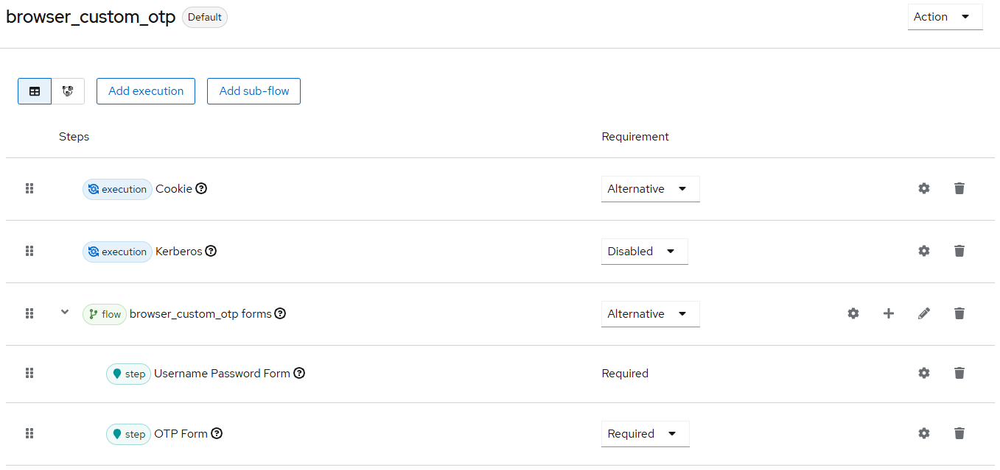

Showcase OTP in Keycloak
------------------------

- tested on Keycloak 26.2

Installation:
- start Keycloak
- Build and deploy: 
    - cd backend
    - mvn clean install
    - run locally with docker:
        - `docker build . -t keycloak-custom-otp`
        - `docker run --name keycloak-custom-otp -p 8443:8443 keycloak-custom-otp start-dev`

Configuration:
- Login to Keycloak as admin
- create new realm `safe` 
- realm settings --> Themes --> set login theme to `otptheme`
- realm settings --> Localization --> Set Internationalization to enabled, supported locales "German" and "English"
- Authentication --> Flows
    - Browser-flow -->  Duplicate with name `browser_custom_otp`
    - Configure like this
    
    - Button "Action" --> Bind flow
- Creat neuen user otp (PW: otp) (firstname, lastname and eMail necessary but anything)
- Im realm master: Clients --> Client safe-realm, tab Roles, button "create role", create role with name "custom-add-otp"
- Users --> User "admin" --> Tab "Role mapping"
    - Button "Assign role", find role "custom-add-otp" and assign
    - Button "Assign role" --> search for "safe-realm" --> assign role "manage-users"  


Test:
- Check user in admin console: 
	- https://localhost:8443/auth/admin/master/console/#/safe/users
	- User otp
- first login:
	- https://localhost:8443/auth/realms/safe/account
	- User: otp/otp
	- should show error message that OTP is not configured 
- rollout OTP via POST-request:
	
	- get token for admin:
	    - POST https://localhost:8443/auth/realms/master/protocol/openid-connect/token
	    - Header: Content-Type application/x-www-form-urlencoded
	    - Body: client_id=admin-cli&grant_type=password&username=admin&password=admin
	    - execute, copy access token 

    - create TOTP for user
        - POST http://localhost:8080/auth/realms/safe/totp
        - Header: Content-Type application/json
        - Header: Authorization bearer <token from Call 1>
        - Body: `{"username": "otp"}`
        - should result in:
    	```
	    {
	    "secret": "gram6k9gm2kqstLoqR9x",
	    "secretQrcode": "iVBORw...kJggg=="
	    }
	    ```

- Copy content of secretQrcode into file backend/src/main/resources/ViewQRCode.html
(aber `base64, ` up to the closing quotes)

- open ViewQrCode.html in browser
- Scan in smartphone with OTP App like FreeOTP or Google Authenticator 
- Second login:
	- this time it asks for OTP 
	- account login page shows

- remove TOTP via DELETE-request
    - get token for admin (see above)
    - remove TOTP
        - DELETE https://localhost:8443/auth/realms/safe/totp/otp
        - Header: Authorization bearer <token from Call 1>
        - no body