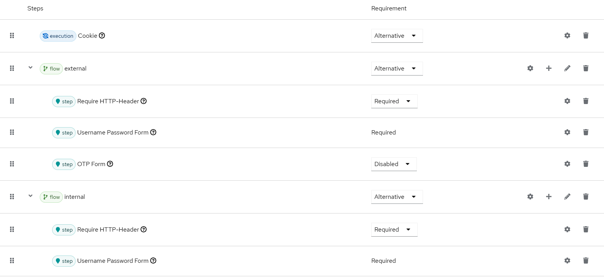
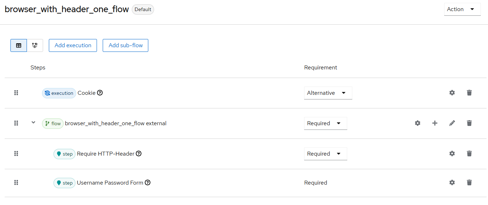

# Require HTTP-Header Authenticator

## Description

Authenticator for evaluating an HTTP header and its value.

## Build

`mvn clean install`

## Deploy

Copy the file `require-http-header-authenticator-X.X.X.jar` from the `target` directory 
(which exists after the build process) into the KeyCloak directory `providers`.

## Configure

The following values are configurable:

* Header Name: The name of the header to be checked
* Header Value: The expected value of the header
* NEGATE-LOGIC: Invert checking logic, i.e. error if the header contains the expected value

## Test

Can be locally tested like this:

### Version 1 - Header set by proxy

* Create new realm `muenchen.de`
* Authentication
    * Flow "Browser" --> Dropdown "Action" --> Duplicate --> Name "browser_with_header"
    * Configure the flow like this: 
      * Subflow "external" --> execution "Require HTTP-Header" --> Settings
        * Alias: external
        * negate logic: Off
        * HTTP Header Name: X-LHM-Origin
        * HTTP Header Value: external
      * Subflow "internal" --> execution "Require HTTP-Header" --> Settings
          * Alias: internal
          * * negate logic: On
          * HTTP Header Name: X-LHM-Origin
          * HTTP Header Value: external
* Create user test with password test in same realm
* Login to account in realm `muenchen.de`, should work with password only 
* Use a proxy to set the header X-LHM-Origin to `external` when calling Keycloak
* Login again, now the 2FA (via OTP) is active and will request a second factor

### Version 2 - Header set manually

* Like above, but only one subflow like this: * Subflow "external" --> execution "Require HTTP-Header" --> Settings
  * Alias: external
  * negate logic: Off
  * HTTP Header Name: X-LHM-Origin
  * HTTP Header Value: external
* With request tool like Bruno, send this request: 
`https://localhost:8443/auth/realms/muenchen.de/protocol/openid-connect/auth?client_id=account-console&redirect_uri=https%3A%2F%2Flocalhost%3A8443%2Fauth%2Frealms%2Fmuenchen.de%2Faccount&response_type=code&code_challenge=WLs5-39Xt_FMLLZyHs18bzag6zInEDt2rQ3GJd0vgLk&code_challenge_method=S256`
* Will return http-400 with error "Invalid username or password."
* Make same request, but this time add a header with key `X-LHM-Origin` and value `external`
* Will return http-200 with login page