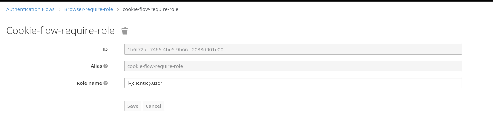
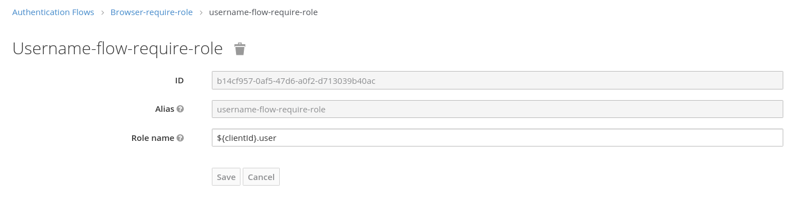
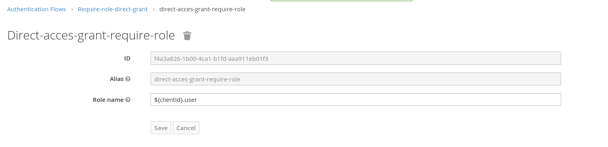
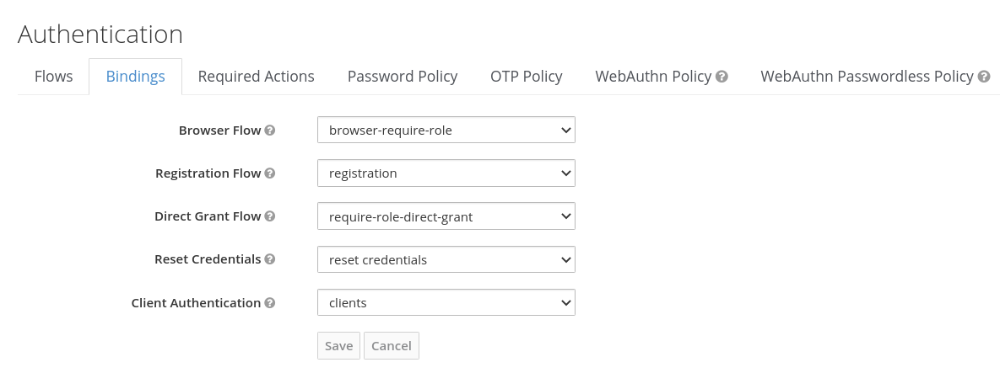
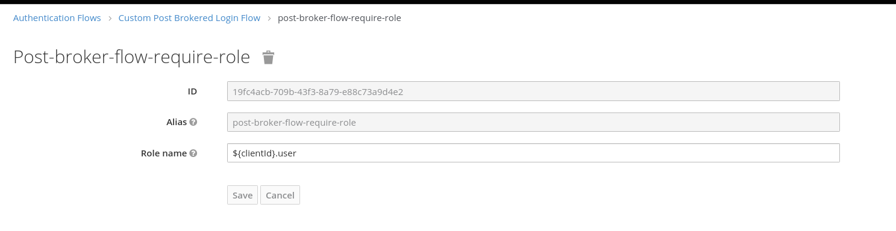
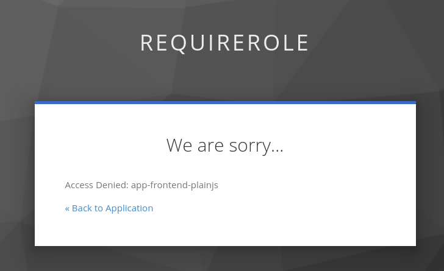

Require Role Authenticator
---

## Keycloak v26

This example has been taken from https://github.com/thomasdarimont/keycloak-extension-playground from the directory `auth-require-role-extension`
and ported to Keycloak v26.

The following setup was tested:

- keycloak 26, Realm "muenchen.de"
- Clients: "client-a" with no client roles, "client-b" with client role "clientrole"
- User: user1 (PW: user1) und user2 (PW: user2); user1 has role "clientrole" from client "client-b"
- Browser-flow "browser-with-require-role" with execution "require role", which requires "${clientId}.clientrole"

**Test:**

Client A (no client role needed, "user1" and "user2" can log in)
https://localhost:8443/auth/realms/muenchen.de/protocol/openid-connect/auth?response_type=code&client_id=client-a&scope=openid%20profile%20email&state=1Gvul5jnemCt6KKoqP1nSDpDMPT6ZS-JgxEO0BUHESE%3D&redirect_uri=http%3A%2F%2Fwww.example.org&nonce=3HdXbB11Op2y0Exn-qIgyCS_F-2PaSkGaFPNoEqliCs

Client B (needs client role "clientrole", only "user1" can log in)
https://localhost:8443/auth/realms/muenchen.de/protocol/openid-connect/auth?response_type=code&client_id=client-b&scope=openid%20profile%20email&state=1Gvul5jnemCt6KKoqP1nSDpDMPT6ZS-JgxEO0BUHESE%3D&redirect_uri=http%3A%2F%2Fwww.example.org&nonce=3HdXbB11Op2y0Exn-qIgyCS_F-2PaSkGaFPNoEqliCs

## From the original readme

This example provides a custom `require-role` authenticator, that allows access to clients based on a client role.
The authenticator configuration supports a dynamic role expression to resolve the required role that a user needs
to have in order to access a client.

The role expression can be a fixed realm role, a fixed client role or a dynamic client role.
An expression without a dot is considered to be a realm role.

## Fixed realm role
The expression `user` would require that a user has the realm role `user` in order to access the application.

## Fixed client role
The expression `client1.user` would require that a user has the role `user` for `client1` in order to access the application.
If `client1` does not have the `user` role this check is ignored.

## Dynamic client role 
The expression `${clientId}.user` would require that a user has the role `user` for the given target client in order to access the application.
If the target client does not have the `user` role this check is ignored.

# Configuration Example

