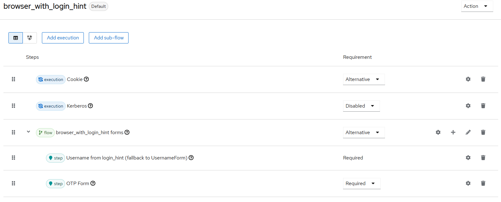

# Username from login_hint Authenticator

## Description

Authenticator that takes the username from the `login_hint` parameter and sets it in the context for later authentication using additional authenticators. 
The authenticator falls back to the Username Form Authenticator if no `login_hint` is set.

**Attention:** Since this is basically a Username Form Authenticator, there always has to be another security check (TOTP etc.) in the flow.

## Build

```
mvn clean install
```


## Deploy

Copy the file `username-from-login_hint-authenticator-X.X.X.jar` from the `target` directory (created after the build process)
to the Keycloak directory `providers`. 

For Keycloak 26.3.x

## Configure

The authenticator is not configurable.

## Test

Can be tested as follows:
* Create new realm `muenchen.de`
* Create user test (no password needed)
* Authentication --> Browser flow
    * Dropdown "Action" --> Duplicate as `browser_with_login_hint`
    * Setup like this:
      
    * "Action" --> Bind flow
* Open in Browser `<base-url>/auth/realms/muenchen.de/account` --> Standard username form shows
* Change URL by adding `&login_hint=test` --> Username form is skipped and OTP page is shown
* Register OTP with smartphone app (FreeOTP etc.) and login with 2nd factor

## References

* https://github.com/keycloak/keycloak/blob/26.3.2/services/src/main/java/org/keycloak/authentication/authenticators/browser/UsernameForm.java
* https://github.com/keycloak/keycloak/blob/26.3.2/services/src/main/java/org/keycloak/authentication/authenticators/browser/UsernameFormFactory.java
* https://github.com/keycloak/keycloak/blob/26.3.2/services/src/main/java/org/keycloak/authentication/authenticators/browser/UsernamePasswordForm.java#L105